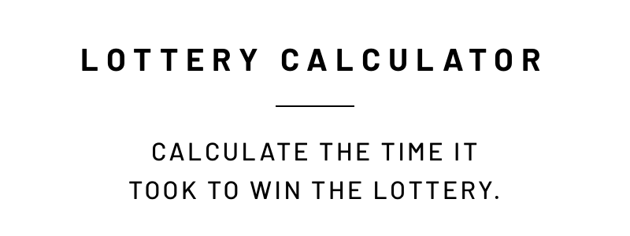
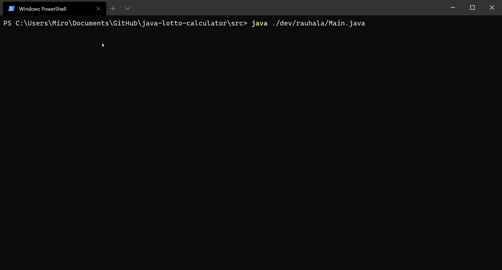

<p align="center"></p>

## Lottery Calculator
This is a CLI app written in Java that calculates the time it takes to win a jackpot in the lottery.

## Motivation
This project is a part of the `Introduction to Programming` course I am taking at school. This project exists for the reason that we as students learn good programming practises.

## Screenshots


## Features

This lottery calculator calculates the chances of winning the lottery with the following algorithm. A user is asked to input their guess of the winning numbers. By default, the user is asked seven numbers. 

The app will then count how long it takes to win with one correct lottery number, then two, and so on. To calculate how long it takes to win the lottery, one iteration equals one week. Therefore by iterating the winning numbers until they match the user given inputs, we can calculate the amount of iterations, and therefore, weeks it took. From weeks we can calculate the years.

If the jackpot (7 by default) is won in under 120 years the program will end. This is very unlikely.

## Installation

This project assumes you have Java and Git installed.

To install this, run the following commands:

```bash
git clone https://github.com/mirorauhala/java-lottery-calculator.git
cd java-lotto-calculator/src
javac ./dev/rauhala/Main.java
```

After that you will be able to run the compiled app with the following command:
```bash
java ./dev/rauhala/Main.java
```

## Documentation

The documentation is available [here](https://mirorauhala.github.io/java-lottery-calculator). Its contents are derived from the `docs/` folder.


### Building the documentation

To build the documentation, run the following commands:
```bash
cd java-lotto-calculator/src
javadoc -author -d ../docs -subpackages dev
```

